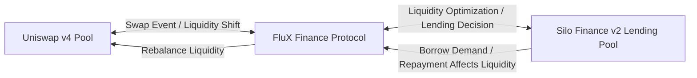

# FluX - DeFi Automated Liquidity Manager

> A project built and submitted for Eth Denver 2025 Hackathon

> FluX, the **Liquidity Managorrr,  Optimizorrr & Adjustorrrr**

FluX is an MVP of a DeFi product focused on adjusting liquidity provided between a Uniswap v4 swapping pair and a lending pool on Silo Finance v2. By allocating dynamically liquidity between these two DeFi protocols, it aims o optimise revenues for lenders and liquidity providers.

> **Technologies used:**
> - Silo Finance v2
> - Uniswap v4
> - ChainLink

## Overview

Liquidity providers on Uniswap v4 can often end up not generating any revenues from swapping fees for the liquidity they have provided to the pool because their liquidity is configured to be used on certain price ranges.

This creates scenarios where their liquidity is _"idled"_ because it does not fall in the price range they have provided.

FluX solves this problem by re-allocating automatically idle liquidity into lending protocol that use Silo Finance v2. 

FluX goal is to optimize liquidity allocation between DeFi markets. In thi  s MVP it balances liquidity between swapping and lending pool, in order to not let liquidity idle (not generating revenue).

## How it works?

FluX uses hooks from Uniswap v4 and Silo Finance v2 to adjust liquidity automatically between these two markets.

For instance,**** if the liquidity is idle on Uniswap v4, it will take some of it and provide it in the lending market (a Silo from Silo Finance) where it can generate borrowing interests.

It works by taking idle liquidity in Uniswap v4 pair (= liquidity that is not actively being utilized in swaps) and provide it in a lending market (a Silo from Silo Finance) where it can generate borrowing interests.

## Examples user flow

### Example 1: move liquidity when swapping

1. Alice provided Liquidity to Uniswap v4 for the pair ETH / USDC. Her liquidity is configured to be used for the price range 1,800 USD to 2,100 USD.

2. A user

## Limitations

This example is very barebone and used as an MVP. It works for simplicity as assuming there is a single address that provided liquidity to the pool on both the Uniswap v4 pair and the Silo Finance v2 lending pool.

## Resources used

- [Silo Finance v2 docs - Hooks Tutorial](https://docs.silo.finance/docs/developers/dev-tutorials/hooks)
- [ChainLink Price Data Feed for USDC / ETH](https://docs.chain.link/data-feeds/price-feeds/addresses?network=ethereum&page=1&search=USDC+%2F+ETH)

